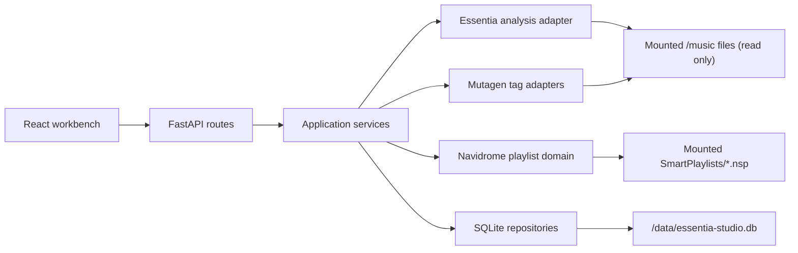

# Essentia Studio Architecture

The normative product decisions live in the [approved design](superpowers/specs/2026-07-16-essentia-studio-design.md). This page is the short contributor map.

## Dependency direction

HTTP routes validate transport models and call application services. Services coordinate domain operations and repositories. Domain modules do not import FastAPI, React, or database sessions. Analysis does not import tag writers. Tag adapters do not import model code. Playlist code does not depend on the analysis pipeline.

The frontend follows the same feature boundaries: Workbench, Playlists, Jobs, Settings, and About. Shared components contain presentation behavior only; feature state and API contracts remain with their owning feature.

## Mutation boundary

Scanning and inference read mounted audio. Tag writes, undo, and playlist mutations are the only filesystem-mutating workflows and are serialized by the job coordinator. Database transactions do not span model inference or filesystem writes. Each external mutation is followed by direct verification before persistence records success.

## Further reading

- [Implementation roadmap](superpowers/plans/2026-07-16-essentia-studio-roadmap.md)
- [Development setup](development.md)
- [Licensing and third-party notices](licenses.md)
